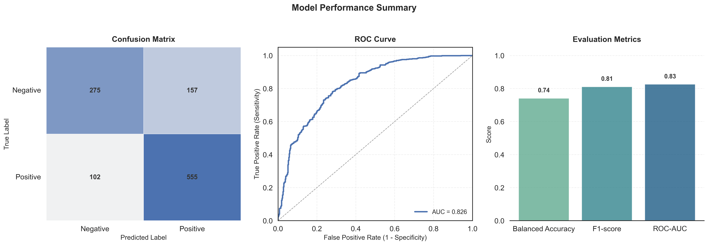

# Post-Modeling Bias Detection

Post-modeling bias detection evaluates whether a trained model produces fair predictions across different demographic groups. This stage assesses model outputs to identify disparate treatment or impact that may disadvantage protected populations.

## Fairness Metrics

Four key metrics quantify different dimensions of algorithmic fairness:

- **Statistical Parity Difference (SPD)**: Measures the difference in positive prediction rates between privileged and unprivileged groups. A value of zero indicates equal treatment; deviations from zero signal potential bias.

- **Disparate Impact Ratio (DIR)**: Compares the ratio of positive outcomes between unprivileged and privileged groups. A value of 1.0 indicates parity. Values below 0.8 or above 1.25 are commonly considered evidence of disparate impact.

- **Equal Opportunity Difference (EOD)**: Quantifies the difference in true positive rates (recall) between groups. A value near zero ensures both groups have equal probability of correctly receiving positive predictions when they should.

- **Average Odds Difference (AOD)**: Aggregates differences in both false positive and true positive rates across groups. A value near zero indicates balanced performance, minimizing both missed opportunities and false alarms for all groups.

| **Metric**                              | **Equation**                                                                  | **Meaning of Symbols**                                                                    |
| --------------------------------------- | ----------------------------------------------------------------------------- | ----------------------------------------------------------------------------------------- |
| **Statistical Parity Difference (SPD)** | $\text{SPD} = P(\hat{Y} = 1 \mid A = 1) - P(\hat{Y} = 1 \mid A = 0)$ | $A$: protected attribute (1 = privileged, 0 = unprivileged); $\hat{Y}$: model prediction |
| **Disparate Impact Ratio (DIR)**        | $\text{DIR} = \frac{P(\hat{Y} = 1 \mid A = 0)}{P(\hat{Y} = 1 \mid A = 1)}$ | Ratio of positive outcomes for unprivileged vs privileged group                           |
| **Equal Opportunity Difference (EOD)**  | $\text{EOD} = \text{TPR}_{A=1} - \text{TPR}_{A=0}$                                        | $\text{TPR}$: True Positive Rate = $P(\hat{Y} = 1 \mid Y = 1)$                                   |
| **Average Odds Difference (AOD)**       | $\text{AOD} = \frac{[(\text{TPR}_{A=1} - \text{TPR}_{A=0}) + (\text{FPR}_{A=1} - \text{FPR}_{A=0})]}{2}$ | $\text{FPR}$: False Positive Rate = $P(\hat{Y} = 1 \mid Y = 0)$                                  |                          |

---

**Key Findings:**

| Protected Attribute                | Statistical Parity Difference | Disparate Impact Ratio | Equal Opportunity Difference | Average Odds Difference |
|------------------------------------|------------------------------|-----------------------|-----------------------------|------------------------|
| Marital status                     | 0.2382                  | **1.5461**            | 0.1472              | 0.1918             |
| Application mode                   | **0.6556**                   | 0.0                   | **0.846**                   | **0.6056**             |
| Application order                  | 0.1805                  | 1.3034            | 0.101                       | 0.1406                 |
| Course                             | 0.0304                       | 1.0486                | 0.0617                      | -0.0231                |
| Daytime/evening attendance         | -0.1814                  | 0.7303                | -0.2262                 | -0.1534          |
| Previous qualification             | **0.6593**                   | 0.0                   | **0.8473**                  | **0.6084**             |
| Previous qualification (grade)     |  -                            | -                      | **0.8447**                  | 0.1041                 |
| Nationality                        |  -                            | -                      | **0.8447**                  | 0.1041                 |
| Mother's qualification             | -0.0131                      | 0.9803                | 0.0603                      | -0.0029                |
| Father's qualification             | 0.1558                   | 1.3116            | 0.2763                 | 0.105                  |
| Mother's occupation                | 0.1579                  | 1.3157            | 0.1333                      | 0.1068                 |
| Father's occupation                | 0.0788                       | 1.1365                | 0.0331                      | 0.1002                 |
| Admission grade                    | -                             |  -                     | **0.8447**                  | 0.1041                 |
| Displaced                          | -0.187                   | 0.7459                | -0.0901                     | -0.1409                |
| Educational special needs          | **-0.3488**                  | 0.6512                | -0.1567                 | **-0.3981**            |
| Debtor                             | **0.4866**                   | **3.135**             | 0.2388                  | 0.2717             |
| Gender                             | **0.39**                     | **1.9886**            | **0.3081**                  | 0.2953             |
| Scholarship holder                 | **-0.3992**                  | 0.5809                | -0.2127                 | **-0.3436**            |
| Age at enrollment                  | **-0.3346**                  | 0.6308                | -0.1441                 | **-0.3251**            |
| International                      | -0.0872                      | 0.8821                | -0.1581                     | -0.1258                |
| Unemployment rate                  | -0.0576                      | 0.9185                | 0.0155                      | -0.0157                |
| Inflation rate                     | -0.0575                      | 0.9186                | -0.0757                     | -0.0759                |
| GDP                                | 0.003                        | 1.0046                | 0.0154                      | -0.0044                |

---

The baseline XGBoost model identifies significant fairness considerations across multiple protected attributes (bold values indicate concerning bias):

**Critical Fairness Issues:**

- **Application mode** (SPD=0.66, EOD=0.85, AOD=0.61): The most severe bias detected. Students from certain application pathways face dramatically different prediction outcomes, with some groups systematically disadvantaged in graduation predictions.

- **Previous qualification** (SPD=0.66, EOD=0.85, AOD=0.61): Strong disparities based on prior educational background, potentially perpetuating existing educational inequalities.

- **Debtor** (SPD=0.49, DIR=3.14): Students in debt are substantially more likely to receive negative predictions. The DIR of 3.14 indicates debtors receive positive outcomes at three times the rate of non-debtors, revealing extreme model bias tied to financial status.

- **Gender** (SPD=0.39, DIR=1.99): Male students receive positive predictions at nearly twice the rate of female students, representing significant gender-based discrimination in model outputs.

- **Scholarship holder** (SPD=-0.40, AOD=-0.34): Scholarship recipients face lower positive prediction rates, disadvantaging students with financial support.

- **Age at enrollment** (SPD=-0.33, AOD=-0.33): Older students receive systematically worse predictions, discriminating against non-traditional students.

- **Educational special needs** (SPD=-0.35, AOD=-0.40): Students with special needs face substantial bias, indicating the model may unfairly predict lower graduation likelihood for this vulnerable population.

---

## Model Performance Evaluation

The baseline XGBoost model demonstrates strong predictive performance while revealing important insights about prediction patterns:

**Confusion Matrix Analysis:**

| Prediction Type | Count | Interpretation |
|----------------|-------|----------------|
| **True Negatives** | 275 | Correctly predicted dropouts (target=0), showing good ability to identify at-risk students |
| **True Positives** | 555 | Correctly predicted graduates (target=1), demonstrating strong performance on the majority class |
| **False Positives** | 157 | Incorrectly predicted graduation when students actually dropped out—missed intervention opportunities |
| **False Negatives** | 102 | Incorrectly predicted dropout when students actually graduated—potentially denying support or opportunities |

**Performance Metrics:**

| Metric | Value | Interpretation |
|--------|-------|----------------|
| **Balanced Accuracy** | 0.74 | Accounts for class imbalance by averaging recall across both classes, indicating reasonably good performance on both graduates and dropouts |
| **F1-Score** | 0.81 | Harmonic mean of precision and recall shows strong overall predictive capability, slightly favoring the majority (graduate) class |
| **ROC-AUC** | 0.83 | Strong discriminative ability to distinguish between graduates and dropouts across various decision thresholds |

The model achieves solid predictive performance (ROC-AUC=0.83) but the confusion matrix reveals an important pattern: the model is more likely to incorrectly predict graduation (157 false positives) than incorrectly predict dropout (102 false negatives). This asymmetry, combined with the significant fairness considerations identified above, suggests the model's errors may not be randomly distributed across demographic groups. 

