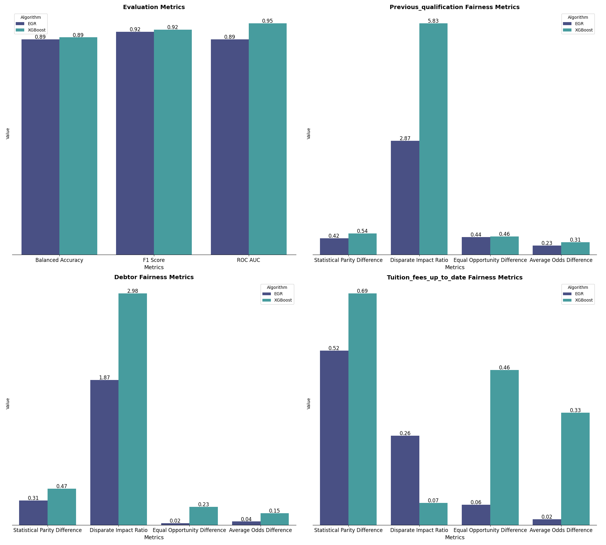

## Adversarial Debiasing

Adversarial Debiasing is an in-processing technique that helps machine learning models make fairer predictions by reducing the influence of protected attributes (like gender or race). It uses two models trained together:

- The **Predictor** learns to predict the target outcome as accurately as possible.
- The **Adversary** tries to predict the protected attribute from the Predictor’s output.

During training, the Predictor is encouraged to make accurate predictions while hiding information about the protected attribute. The Adversary tries to uncover this hidden information. As the two models compete, the Predictor learns to make predictions that are less biased by sensitive attributes.

This process is repeated in several steps:
1. Train the Predictor to predict the target variable.
2. Train the Adversary to predict the protected attribute from the Predictor’s output.
3. Update both models so the Predictor becomes less informative about the protected attribute, and the Adversary becomes less able to predict it.
4. Repeat until the Predictor is accurate and fair.

Adversarial Debiasing is flexible and can be used for different fairness goals, such as demographic parity or equality of odds. It works with many types of data and tasks, including classification and regression. The main advantage is that it can reduce bias without changing the data or the model’s structure, making it a powerful tool for fair machine learning.

## Exponentiated Gradient Reduction

The reductions approach is an in-processing method for achieving fairness in binary classification tasks. It works by breaking down the problem into smaller, cost-sensitive classification tasks, allowing the model to meet fairness goals like demographic parity and equalized odds.

Instead of changing the data or the model after training, this method treats the classifier as a "black box" and applies fairness constraints during training. The goal is to find the most accurate classifier that also satisfies fairness requirements, without needing sensitive information at test time.

Two main fairness definitions are used:

- **Demographic parity**: The model's predictions are independent of the protected attribute (e.g., gender or race).
- **Equalized odds**: The model's predictions are independent of the protected attribute, given the true label.

The reductions approach uses linear constraints to enforce these fairness definitions. The training process solves an optimization problem: it minimizes classification error while making sure the fairness constraints are met. Sometimes, the method uses randomized classifiers, which choose from a set of possible classifiers to get the best balance between accuracy and fairness.

