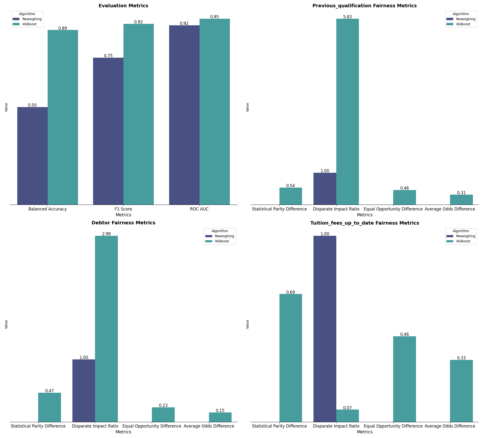

Fairness pre-processing focuses on preparing the data in a way that reduces bias before it is used to train a model.

### Learning Fair Representation (LFR)
Learning Fair Representation (LFR) is a pre-processing method that transforms the data into a new representation that keeps as much useful information as possible and hides information related to protected group membership.

LFR tries to satisfy two types of fairness at the same time:

- *Group fairness* : Different demographic groups should receive positive predictions at similar rates
- *Individual fairness* : Similar individuals should receive similar predictions

The method turns fairness into an optimisation problem. 
It learns a new representation of the data that reduces the model’s ability to detect membership in the protected group (*group fairness*), keeps similar individuals close in the new space (*individual fairness*) and remains predictive enough for the target task (*accuracy*)

### Reweighing
Reweighing is a fairness pre-processing technique that adjusts the importance of each sample in the dataset according to its group and class. The main idea is to give higher weights to samples from underrepresented or disadvantaged groups, and lower weights to those from overrepresented or privileged groups. This helps the model learn in a way that is less biased and more balanced.

In practice, each sample receives a weight based on its group (such as gender or ethnicity) and its outcome (positive or negative). When a group is underrepresented, its samples are assigned higher weights, increasing their influence during model training. Conversely, samples from overrepresented groups get lower weights, reducing their impact. The model is then trained using these adjusted weights, which helps balance the learning process and reduce bias.

