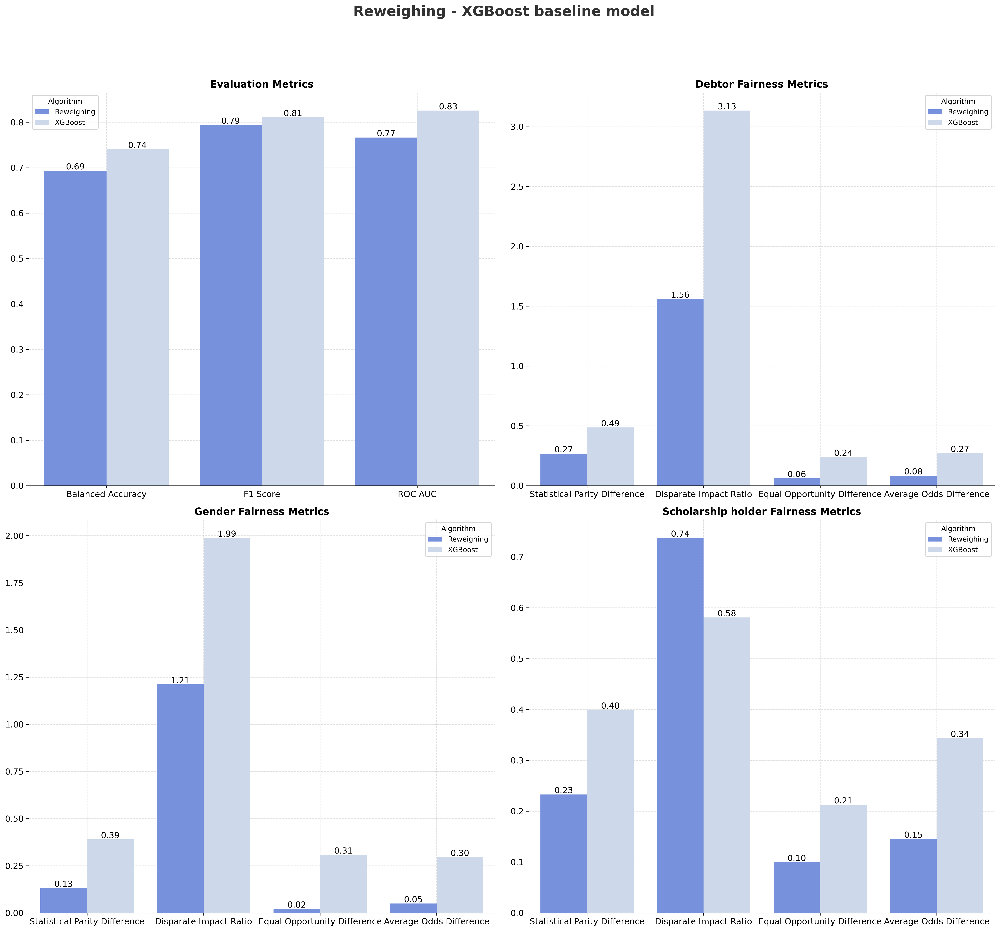

# Pre-Processing Bias Mitigation

Pre-processing techniques transform training data to reduce bias before model training begins. By addressing discriminatory patterns in the data itself, these methods enable any downstream classifier to learn from more equitable representations, without requiring modifications to training algorithms.

---

## Learning Fair Representations (LFR)

*R. Zemel, Y. Wu, K. Swersky, T. Pitassi, and C. Dwork, “Learning Fair
 Representations.” International Conference on Machine Learning, 2013*

Learning Fair Representations transforms input features into an intermediate representation that preserves predictive information while obscuring protected attribute membership. This learned embedding space balances three competing objectives through joint optimization:

- **Group Fairness**: Minimize statistical dependence between the learned representation and protected attributes, preventing the model from encoding demographic information
- **Individual Fairness**: Preserve similarity relationships—individuals who are similar in the original feature space remain close in the transformed space, ensuring consistent treatment
- **Predictive Accuracy**: Maintain sufficient information in the representation to accurately predict the target outcome

LFR formulates fairness as a constrained optimization problem, learning a probabilistic mapping from original features to a lower-dimensional fair representation. The algorithm uses an encoder-decoder architecture that balances reconstruction accuracy, target prediction capability, and demographic parity simultaneously. This approach provides a theoretically grounded method for removing bias while controlling the fairness-accuracy tradeoff.

**Results:**

The LFR algorithm demonstrates effective bias reduction with minimal accuracy loss compared to the baseline XGBoost model:

**Performance Metrics:**

| Performance Metric | Baseline | LFR |
|-------------------|----------|-----|
| Balanced Accuracy | 0.74 | 0.70 |
| F1-Score | 0.81 | 0.79 |
| ROC-AUC | 0.83 | 0.79 |

**Fairness Improvements:**

| Protected Attribute | Metric | Baseline | LFR | Improvement |
|---------------------|--------|----------|-----|-------------|
| **Debtor** | Statistical Parity Difference | 0.49 | 0.45 | ✓ |
| | Disparate Impact Ratio | 3.14 | 2.52 | ✓ |
| | Equal Opportunity Difference | 0.24 | 0.20 | ✓ |
| | Average Odds Difference | 0.27 | 0.25 | ✓ |
| **Gender** | Statistical Parity Difference | 0.39 | 0.43 | ✗ |
| | Disparate Impact Ratio | 1.99 | 2.09 | ✗ |
| | Equal Opportunity Difference | 0.31 | 0.30 | ✓ |
| | Average Odds Difference | 0.30 | 0.36 | ✗ |
| **Scholarship holder** | Statistical Parity Difference | -0.40 | -0.37 | ✓ |
| | Disparate Impact Ratio | 0.58 | 0.62 | ✓ |
| | Equal Opportunity Difference | -0.21 | -0.20 | ✓ |
| | Average Odds Difference | -0.34 | -0.34 | - |

LFR achieves mixed fairness results while preserving strong predictive performance (ROC-AUC: 0.79, only 5% below baseline). 

The method successfully improves fairness metrics results for Debtor (all metrics improved) and Scholarship holder (3 of 4 metrics improved). However, Gender fairness worsens in 3 metrics, particularly for Statistical Parity Difference and Disparate Impact Ratio. The mixed results highlight the fundamental challenge of simultaneously optimizing multiple fairness criteria—improving group fairness for some attributes may degrade it for others. 

This tradeoff demonstrates that LFR achieves partial debiasing rather than universal fairness across all protected groups and metrics.

---

## Reweighing
*F. Kamiran and T. Calders, “Data Preprocessing Techniques for Classification
 without Discrimination,” Knowledge and Information Systems, 2012* 

Reweighing is a pre-processing technique that assigns sample-specific weights to correct for imbalances in the joint distribution of protected attributes and outcomes. Rather than modifying features or labels, this method adjusts the relative importance of training instances to achieve statistical parity.

Each training sample receives a weight calculated based on its protected group membership and target class:

$w_{i} = \frac{P(\text{group}) \times P(\text{label})}{P(\text{group}, \text{label})}$

- **Underrepresented combinations** (e.g., unprivileged group with positive outcomes) receive higher weights, amplifying their influence during training
- **Overrepresented combinations** (e.g., privileged group with positive outcomes) receive lower weights, reducing their disproportionate impact
- The weighted dataset satisfies demographic parity: $P(\hat{Y}=1 | A=0) \approx P(\hat{Y}=1 | A=1)$

After weight computation, any standard classifier can be trained using weighted loss functions or weighted sampling. This simplicity makes reweighing widely applicable across different model architectures without requiring algorithm-specific modifications. However, extreme weights may arise when certain group-label combinations are rare, potentially leading to training instability or overfitting.

**Results:**

Reweighing achieves substantial fairness improvements while maintaining strong predictive performance:

**Performance Metrics:**

| Performance Metric | Baseline | Reweighing |
|-------------------|----------|------------|
| Balanced Accuracy | 0.74 | 0.69 |
| F1-Score | 0.81 | 0.79 |
| ROC-AUC | 0.83 | 0.77 |

**Fairness Improvements:**

| Protected Attribute | Metric | Baseline | Reweighing | Improvement |
|---------------------|--------|----------|------------|-------------|
| **Debtor** | Statistical Parity Difference | 0.49 | 0.27 | ✓ |
| | Disparate Impact Ratio | 3.14 | 1.56 | ✓ |
| | Equal Opportunity Difference | 0.24 | 0.06 | ✓ |
| | Average Odds Difference | 0.27 | 0.08 | ✓ |
| **Gender** | Statistical Parity Difference | 0.39 | 0.13 | ✓ |
| | Disparate Impact Ratio | 1.99 | 1.21 | ✓ |
| | Equal Opportunity Difference | 0.31 | 0.02 | ✓ |
| | Average Odds Difference | 0.30 | 0.05 | ✓ |
| **Scholarship holder** | Statistical Parity Difference | -0.40 | -0.23 | ✓ |
| | Disparate Impact Ratio | 0.58 | 0.74 | ✓ |
| | Equal Opportunity Difference | -0.21 | -0.10 | ✓ |
| | Average Odds Difference | -0.34 | -0.15 | ✓ |

Reweighing demonstrates exceptional fairness improvements across all protected attributes while maintaining strong predictive performance (ROC-AUC: 0.77, only 7% below baseline). 

The method achieves consistent metric improvements for Debtor, Gender, and Scholarship holder, with particularly dramatic reductions in bias measures. 

By correcting distributional imbalances through sample weighting, Reweighing effectively balances fairness and accuracy, making it a strong candidate among pre-processing methods for bias mitigation in student retention prediction. While residual disparities persist, particularly for Debtor (DIR=1.56), the consistent improvements across all demographic groups suggest data-level corrections provide a solid foundation for fair predictions.

