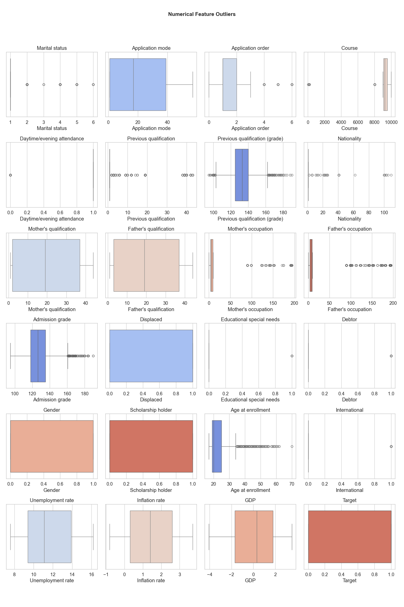
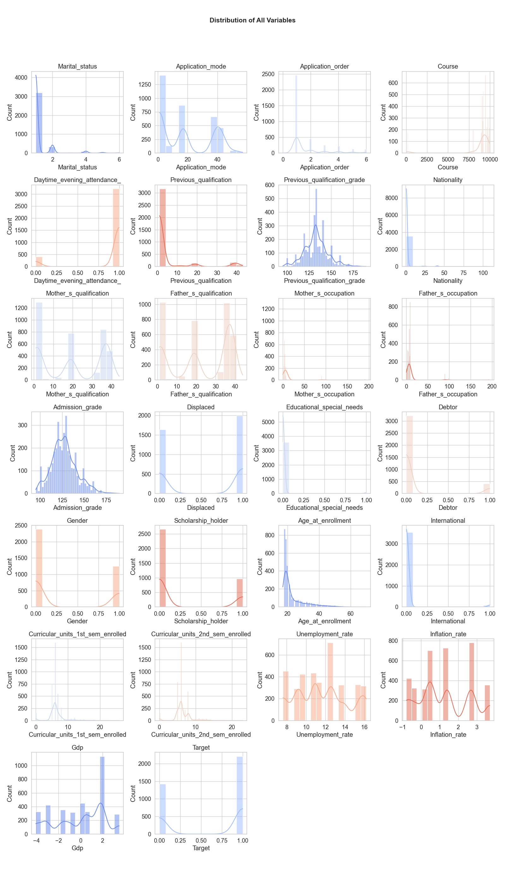

## Dataset Overview

The dataset analyzed in this study is the [Predict Students' Dropout and Academic Success](https://archive.ics.uci.edu/dataset/697/predict+students+dropout+and+academic+success) dataset from the UCI Machine Learning Repository. It is provided by the SATDAP program (Capacitação da Administração Pública, grant POCI-05-5762-FSE-000191, Portugal). Sourced from a higher education institution, it is compiled from multiple databases and covers student records across a range of undergraduate programs, including agronomy, design, education, nursing, journalism, management, social service, and technology fields.

This dataset contains information available at the time of student enrollment, such as academic history, demographic attributes, and socio-economic indicators. It also includes academic performance data from the end of the first and second semesters.

In total, the dataset comprises 4,424 rows and 37 variables, offering a comprehensive view of student trajectories and outcomes for fairness analysis.

---

## Data Preprocessing Steps
1. **Column Cleaning**: Standardize column names, remove leakage-prone columns, and fix naming inconsistencies.
2. **Target Filtering**: Keep only 'Dropout' and 'Graduate' values in the target column, mapping them to 0 and 1, accordingly.
3. **Standard Dataset Creation**: Prepare the dataset for fairness analysis using the `StandardDataset` class:
    - Remove rows with missing (NA) values to ensure data completeness
    - Create one-hot encoding of categorical variables for model compatibility
    - Map protected attributes to binary privileged (1) / unprivileged (0) values
    - Map target labels to binary favorable (1) / unfavorable (0) values
4. **Outlier Detection**: Use boxplots to detect outliers in all numerical features.
5. **Feature Distributions**: Plot distributions for all variables (numerical and categorical) to understand their spread and balance.

---

## Outlier Analysis

**Key Results:**

- **Application mode** and **Application order** show substantial outliers, with some extreme values that may represent uncommon enrollment pathways or data entry issues.
- **Previous qualification** and **Previous qualification (grade)** contain outliers on both ends, indicating students with exceptionally high or low prior academic performance.
- **Course** has a few high outliers, likely representing specialized or less common programs.
- **Admission grade** displays numerous outliers above 160, suggesting some students achieved exceptionally high entrance scores.
- **Age at enrollment** contains many outliers beyond 40, indicating a population of mature or non-traditional students.
- **Mother's and Father's qualifications and occupations** show multiple outliers, reflecting diverse socio-economic backgrounds.
- **Nationality**, **Displaced**, **Educational special needs**, **Debtor**, and **International** are binary, so outliers are non-existent.
- **Unemployment rate**, **Inflation rate**, and **GDP** have few outliers, as these are macroeconomic indicators that typically follow stable distributions.
- **Target** variable shows no outliers, confirming it's a clean binary classification task.

---

## Variable Distributions

**Key Results:**

**Categorical Features:**

- **Marital status**: Heavily dominated by one category (single students), with very few married students
- **Gender**: Moderate imbalance, with female gender slightly more represented than male.
- **Scholarship holder**: Imbalanced, with more students not holding scholarships
- **Debtor** and **Educational special needs**: Highly imbalanced, with most students not being debtors or having special needs
- **Daytime/evening attendance**: Strongly skewed toward daytime attendance
- **Displaced** and **International**: Most students are not displaced or international

**Numerical Features:**

- **Admission grade**: Right-skewed distribution, with most students having moderate to high admission grades (120-160 range)
- **Age at enrollment**: Right-skewed, with most students enrolling in their early 20s; some older outliers present
- **Previous qualification (grade)**: Normal distribution centered around 140-150
- **Application mode** and **Application order**: Concentrated in specific modes/orders, indicating preferred enrollment pathways
- **Course**: Multiple peaks suggest different course popularities
- **Unemployment rate**, **Inflation rate**, and **GDP**: Economic indicators show temporal variation

**Target Variable:**

- Binary distribution with slight imbalance favoring one class (more graduates than dropouts)

---

Key findings from the exploratory data analysis reveal significant class imbalances in several categorical features (Gender, Debtor, Scholarship holder) and right-skewed distributions in Age and Admission grades. These characteristics necessitate careful consideration in subsequent fairness analysis and bias mitigation strategies.